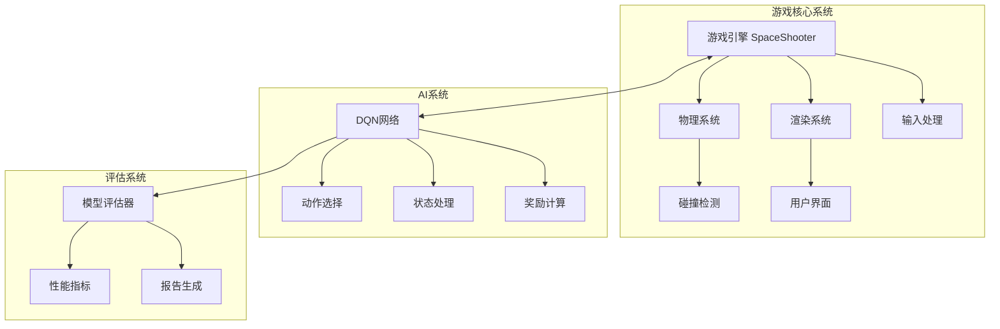
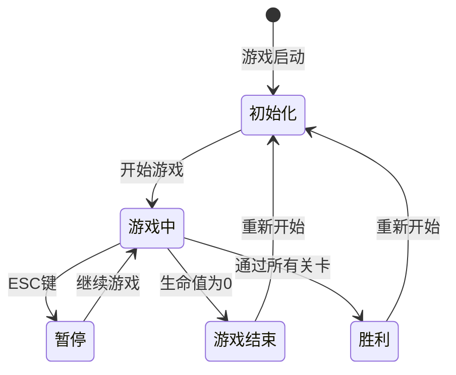
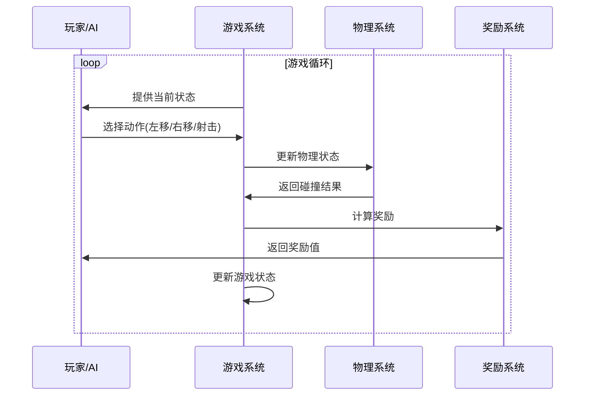

# 太空射击游戏设计文档

## 1. 系统架构图

## 2. 状态转换图

## 3. 交互流程图

## 4. 核心功能说明

### 4.1 游戏引擎 (SpaceShooter)
- 管理游戏主循环
- 处理物理碰撞
- 控制敌人生成
- 管理得分和生命值

### 4.2 AI系统
- 基于DQN的强化学习
- 状态空间：玩家位置、敌人位置、子弹位置
- 动作空间：左移、右移、射击、左移+射击、右移+射击
- 奖励机制：击中敌人(+)、敌人逃脱(-)、被击中(-)

### 4.3 评估系统
- 记录模型性能指标
- 生成评估报告
- 跟踪最佳模型

## 5. 技术特点

1. **模块化设计**
   - 游戏逻辑、AI、评估系统解耦
   - 便于维护和扩展

2. **可配置性**
   - 支持训练模式和游戏模式
   - 可调节游戏参数（速度、难度等）

3. **实时反馈**
   - 显示游戏状态
   - 展示AI决策过程
   - 实时性能指标